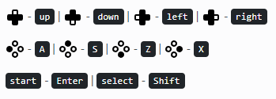

# Documentação do Projeto: Emulador Sega Genesis com React

## Introdução
Este projeto tem como objetivo desenvolver um emulador do console Sega Genesis utilizando React como base para a interface. A aplicação permite a execução de jogos retro, proporcionando uma experiência nostálgica para os usuários.

---

## Tecnologias Utilizadas

- **React**: Biblioteca principal para o desenvolvimento da interface do usuário.
- **React Router DOM**: Gerenciamento de rotas para navegação dentro da aplicação.
- **Nostalgist**: Biblioteca para emulação do hardware Sega Genesis.
- **React DOM**: Renderização dos componentes React no DOM.
- **React Scripts**: Scripts e ferramentas de suporte ao desenvolvimento.
- **CRA Template**: Template base para inicializar o projeto com Create React App.

---

## Estrutura do Projeto

Abaixo está a estrutura inicial do projeto:

```
sega-genesis-emulator/
├── node_modules/       # Dependências do projeto
├── public/             # Arquivos públicos, como index.html
├── src/                # Código-fonte principal
│   ├── components/     # Componentes reutilizáveis
│   ├── pages/          # Páginas da aplicação
│   ├── styles/         # Arquivos de estilo
│   ├── App.js          # Componente principal
│   ├── index.js        # Ponto de entrada do React
├── .gitignore          # Arquivos ignorados pelo Git
├── package.json        # Configuração do projeto e dependências
├── README.md           # Informações gerais do projeto
└── yarn.lock           # Controle de versão das dependências
```

---

## Configuração do Ambiente

### Pré-requisitos

Certifique-se de ter as seguintes ferramentas instaladas no seu ambiente de desenvolvimento:

- **Node.js** (>= 14.x)
- **Yarn** ou **npm**

### Passos para Instalação

1. Clone o repositório:
   ```bash
   git clone https://github.com/seu-usuario/sega-genesis-emulator.git
   ```

2. Navegue para o diretório do projeto:
   ```bash
   cd sega-genesis-emulator
   ```

3. Instale as dependências:
   ```bash
   npm install
   ```

4. Inicie o servidor de desenvolvimento:
   ```bash
   npm start
   ```

5. Acesse a aplicação no navegador:
   ```
   http://localhost:3000
   ```

---

## Funcionalidades

- **Carregar ROMs**: O usuário pode Jogar Jogos Retro de plataformas como GameBoy Advance, SNS, Mega Drive, GENESIS, GBC, GB.
- **Controles Virtuais**: Interface para controles do jogo.

- **Salvamento de Progresso**: Possibilidade de salvar e carregar estados dos jogos.(em testagem)
- **Configurações de Login**: Para acessar a interface deve fazer Login sendo Usuario"ADMIN" e Senha"ADMIN".

---

## Bibliotecas Utilizadas

### Lista de Dependências

- `cra-template@1.2.0`
- `nostalgist@0.11.0`
- `react-dom@18.2.0`
- `react-router-dom@7.1.2`
- `react-scripts@5.0.1`
- `react@18.2.0`

### Nostalgist
**Descrição:** Uma biblioteca de emulação baseada em JavaScript para hardware retro. Oferece suporte ao Sega Genesis com boa performance e compatibilidade.

**Documentação:** [Nostalgist GitHub](https://github.com/nostalgist)

---

## Roadmap

- [x] Configurar ambiente de desenvolvimento
- [x] Implementar interface inicial
- [x] Roms Hospedadas em repositorio
- [ ] Adicionar suporte a ROMs
- [ ] Implementar controles virtuais
- [ ] Desenvolver sistema de salvamento
- [ ] Testes finais e lançamento

---

## Finalização

*"É preciso desafiar as regras para encontrar a verdadeira liberdade; às vezes, voar contra o vento é a única maneira de alcançar o que parece impossível."* – **Elphaba, Wicked.**

Essa frase reflete a ousadia de criar algo inovador e desafiar limites
